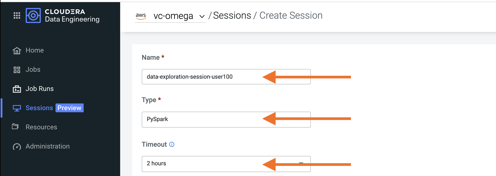
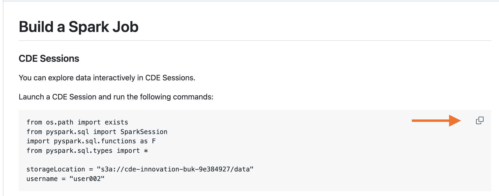

## Iceberg Time Travel & Merge Into

Navigate to the CDE Home Page and launch a PySpark Session. Leave default settings intact.



Once the Session is ready, open the "Interact" tab in order to enter your code.


You can copy and paste code from the instructions into the notebook by clicking on the icon at the top right of the code cell.



Copy the following cell into the notebook. Before running it, ensure that you have edited the "username" variable with your assigned user.

```
from os.path import exists
from pyspark.sql import SparkSession
import pyspark.sql.functions as F
from pyspark.sql.types import *

storageLocation = "s3a://paul-aug26-buk-a3c2b50a/data/pdefusco"
username = "pauldefusco"
```

No more code edits are required. Continue running each code snippet below in separate cells in the notebook.

```
### LOAD HISTORICAL TRANSACTIONS FILE FROM CLOUD STORAGE
transactionsDf = spark.read.json("{0}/icedemo/trans/{1}/rawtransactions".format(storageLocation, username))
transactionsDf.printSchema()
```

```
### LOAD CUSTOMER PII DATA FROM CLOUD STORAGE
piiDf = spark.read.options(header='True', delimiter=',').csv("{0}/icedemo/pii/{1}/pii".format(storageLocation, username))
piiDf.show()
piiDf.printSchema()
```

#### Iceberg Merge Into

Create Transactions Iceberg table:

```
spark.sql("CREATE DATABASE IF NOT EXISTS SPARK_CATALOG.HOL_DB_{}".format(username))

transactionsDf.writeTo("SPARK_CATALOG.HOL_DB_{0}.TRANSACTIONS_{0}".format(username)).using("iceberg").tableProperty("write.format.default", "parquet").createOrReplace()
```

Load New Batch of Transactions in Temp View:

```
trxBatchDf = spark.read.schema("credit_card_number string, credit_card_provider string, event_ts timestamp, latitude double, longitude double, transaction_amount long, transaction_currency string, transaction_type string").json("{0}/icedemo/trans/{1}/trx_batch_1".format(storageLocation, username))
trxBatchDf.createOrReplaceTempView("trx_batch")
```

Sample Merge Into Syntax:

```
MERGE INTO prod.db.target t   -- a target table
USING (SELECT ...) s          -- the source updates
ON t.id = s.id                -- condition to find updates for target rows
WHEN MATCHED AND s.op = 'delete' THEN DELETE -- updates
WHEN MATCHED AND t.count IS NULL AND s.op = 'increment' THEN UPDATE SET t.count = 0
WHEN MATCHED AND s.op = 'increment' THEN UPDATE SET t.count = t.count + 1
WHEN NOT MATCHED THEN INSERT *
```

Run MERGE INTO in order to load new batch into Transactions table:

Spark SQL Command:

```
# PRE-MERGE COUNTS BY TRANSACTION TYPE:
spark.sql("""SELECT TRANSACTION_TYPE, COUNT(*) FROM spark_catalog.HOL_DB_{0}.TRANSACTIONS_{0} GROUP BY TRANSACTION_TYPE""".format(username)).show()

# MERGE OPERATION
spark.sql("""MERGE INTO spark_catalog.HOL_DB_{0}.TRANSACTIONS_{0} t   
USING (SELECT * FROM trx_batch) s          
ON t.credit_card_number = s.credit_card_number               
WHEN MATCHED AND t.transaction_amount < 1000 AND t.transaction_currency != "CHF" THEN UPDATE SET t.transaction_type = "invalid"
WHEN NOT MATCHED THEN INSERT *""".format(username))

# POST-MERGE COUNT:
spark.sql("""SELECT TRANSACTION_TYPE, COUNT(*) FROM spark_catalog.HOL_DB_{0}.TRANSACTIONS_{0} GROUP BY TRANSACTION_TYPE""".format(username)).show()
```

#### Iceberg Time Travel / Incremental Read

Now that you added data to the transactions table you can perform Iceberg Time Travel operations.

```
# ICEBERG TABLE HISTORY (SHOWS EACH SNAPSHOT AND TIMESTAMP)
spark.sql("SELECT * FROM spark_catalog.HOL_DB_{0}.TRANSACTIONS_{0}.history".format(username)).show()

# ICEBERG TABLE SNAPSHOTS (USEFUL FOR INCREMENTAL QUERIES AND TIME TRAVEL)
spark.sql("SELECT * FROM spark_catalog.HOL_DB_{0}.TRANSACTIONS_{0}.snapshots".format(username)).show()

# APPEND SECOND DATA BATCH
trxBatchDf = spark.read.schema("credit_card_number string, credit_card_provider string, event_ts timestamp, latitude double, longitude double, transaction_amount long, transaction_currency string, transaction_type string").json("{0}/icedemo/trans/{1}/trx_batch_2".format(storageLocation, username))
trxBatchDf.writeTo("spark_catalog.HOL_DB_{0}.TRANSACTIONS_{0}".format(username)).using("iceberg").append()

# STORE FIRST AND LAST SNAPSHOT ID'S FROM SNAPSHOTS TABLE
snapshots_df = spark.sql("SELECT * FROM spark_catalog.HOL_DB_{0}.TRANSACTIONS_{0}.snapshots;".format(username))
```

```
last_snapshot = snapshots_df.select("snapshot_id").tail(1)[0][0]
second_snapshot = snapshots_df.select("snapshot_id").collect()[1][0]

incReadDf = spark.read\
    .format("iceberg")\
    .option("start-snapshot-id", second_snapshot)\
    .option("end-snapshot-id", last_snapshot)\
    .load("spark_catalog.HOL_DB_{0}.TRANSACTIONS_{0}".format(username))

print("Incremental Report:")
incReadDf.show()
```
